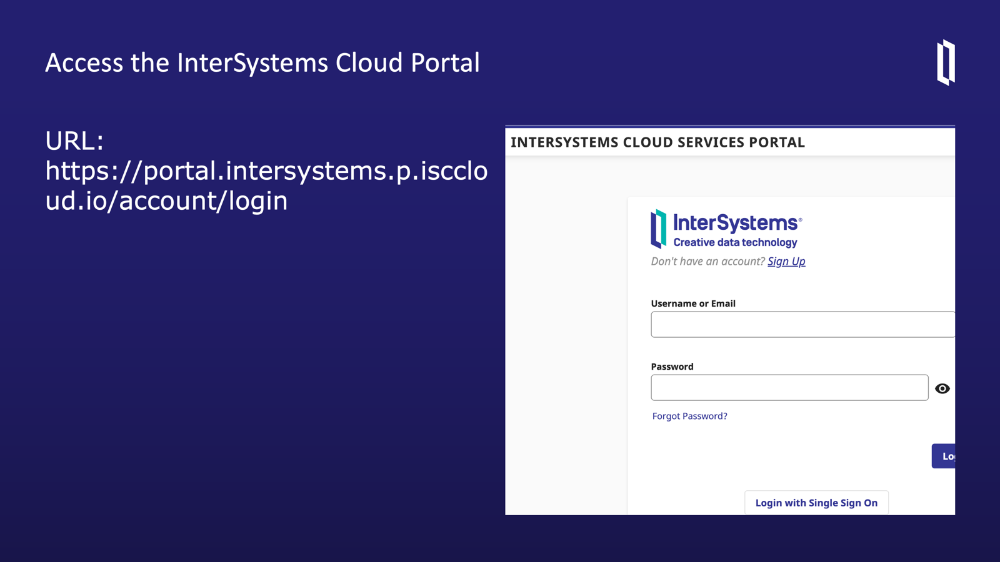
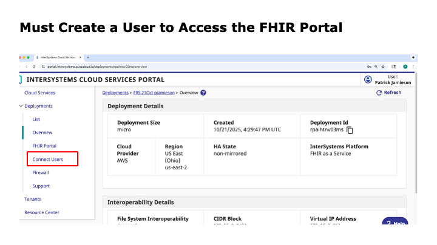
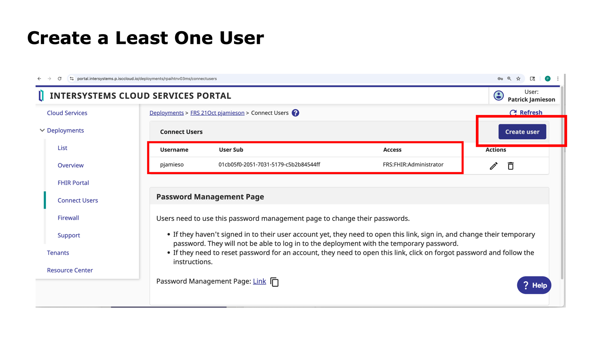
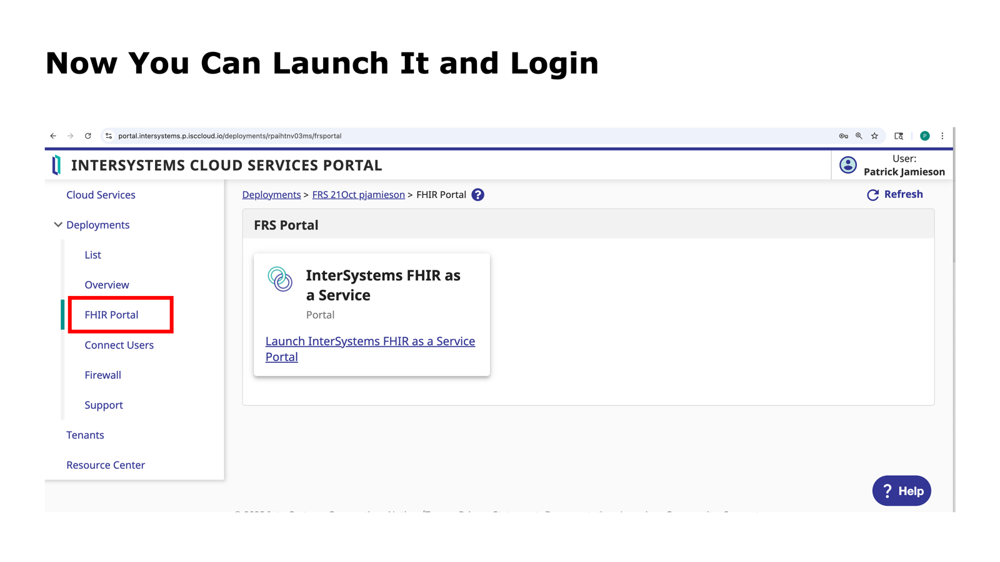

# 🩺 This lesson uses material from FHIR Lesson 21 – Building Simple SMART on FHIR Applications

#### Users should refer to that lesson

👨‍🏫 _Instructors:_  
- **Patrick W. Jamieson, M.D.**, Technical Product Manager  
- **Russ Leftwich, M.D.**, Senior Clinical Advisor, Interoperability  

---
#### To create a deployment, access the following link: https://portal.intersystems.p.isccloud.io/account/login

#### Access the portal user page under connect users (to make a user to we can access the FHIR portal)

### Create a user 

### Launch the portal
